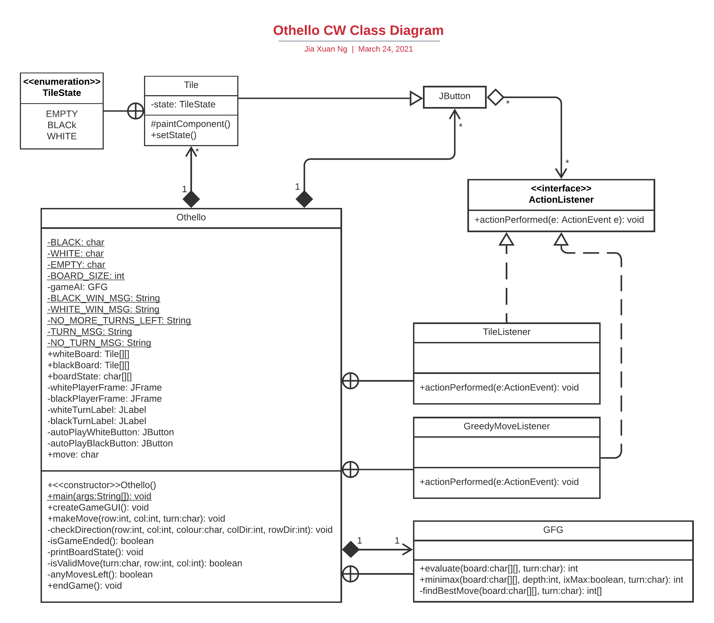

# othello
Othello CW done in Java for COMP1009 | UoN

- Detailed explanation of code in the files themselves.

- Simple class diagram showing the individual classes I used and their immediate dependancies.

